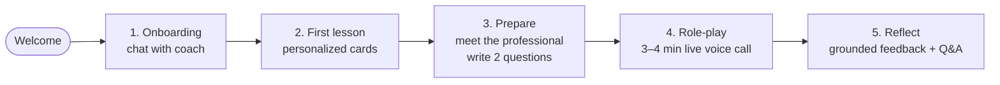
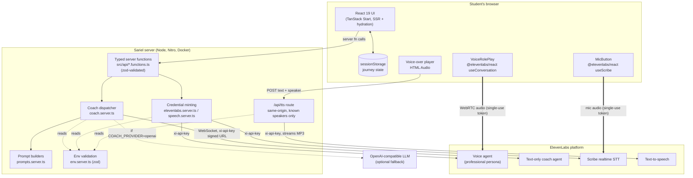
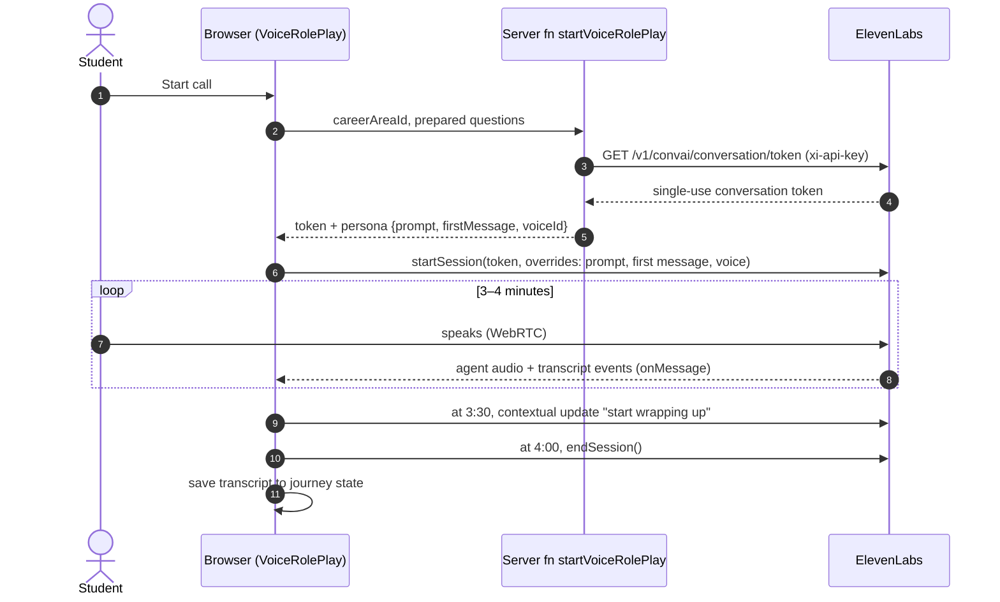
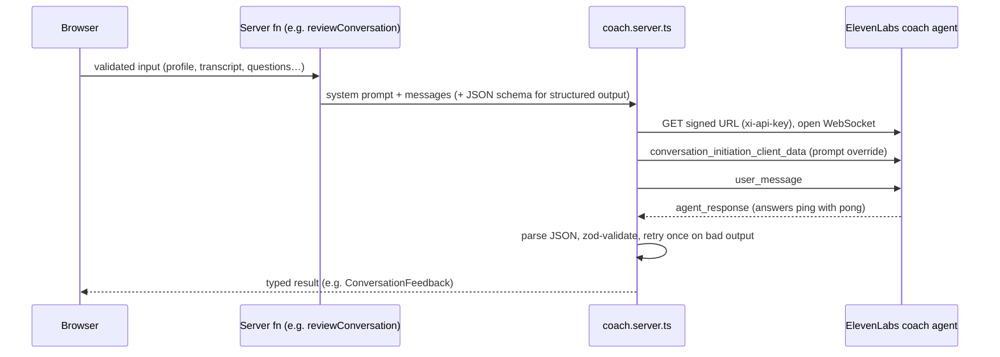
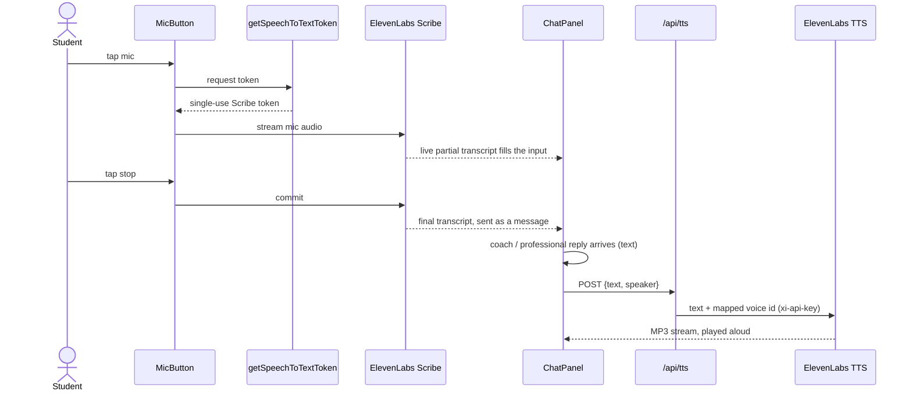
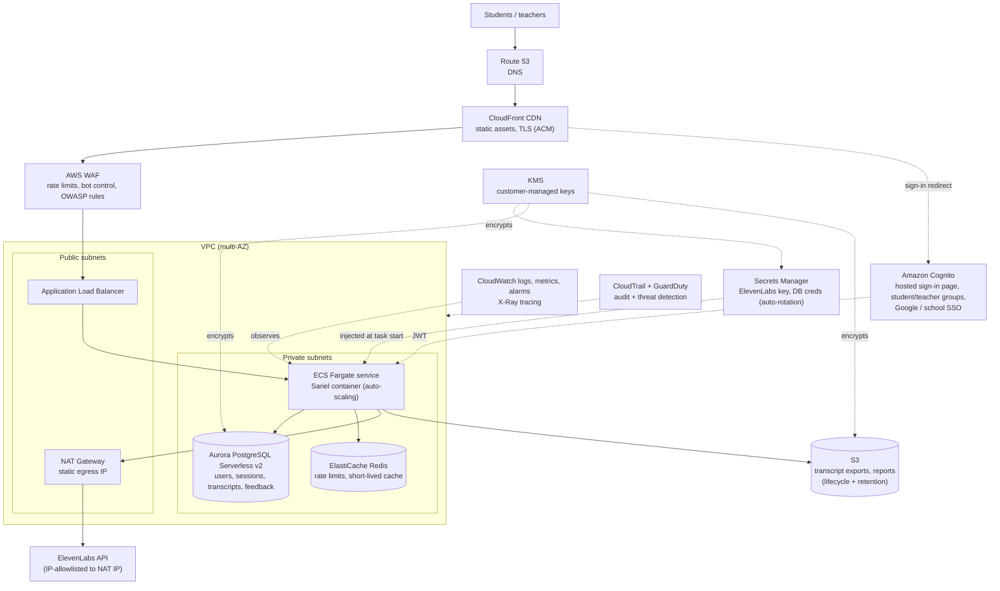

# Sariel: practice your first career conversation

> Hack-Nation × MIT 2026. Networking practice for high-school students, powered by ElevenLabs voice AI.

Most students first try networking when it really counts: an internship ask, an informational interview, a
conversation at a career fair. Sariel lets them **practice out loud first, with no stakes**. A student tells an
AI coach about themselves, takes a short lesson personalized to their interests, prepares two questions, and then
has a **live 3–4 minute voice conversation with a fictional professional**. Afterwards the coach gives feedback that
quotes what the student actually said.

One ElevenLabs API key powers the whole experience:

- the **voice agent** that plays the professional
- the **text agent** behind the coach
- **speech-to-text** for the mic button
- **text-to-speech** for voice-overs

---

## Contents

1. [The student journey](#the-student-journey)
2. [Features](#features)
3. [Architecture](#architecture)
4. [Security model](#security-model)
5. [Tech stack](#tech-stack)
6. [Project structure](#project-structure)
7. [Running it](#running-it)
8. [Configuration](#configuration)
9. [Testing and quality](#testing-and-quality)
10. [Future plans](#future-plans)
11. [AWS production architecture (planned)](#aws-production-architecture-planned)

---

## The student journey



| Step | What the student does | How it's built |
| --- | --- | --- |
| **1. Onboarding** | Chats about interests, activities, experiences, and how comfortable they are meeting new people | The coach asks follow-ups. Sariel builds a profile and suggests **one** career area, which the student confirms or changes |
| **2. First lesson** | Learns why networking matters and how a good conversation goes | Short lesson cards whose examples use the student's own interests and chosen area, plus an "Ask Sariel" chat |
| **3. Prepare** | Meets a fictional professional and drafts two questions | Profile card (role, career path, typical work, things to ask about), with AI feedback on each question: what works, what to improve, a suggested revision |
| **4. Role-play** | Has a real voice conversation | ElevenLabs voice agent stays fully in character with no coaching interruptions. On-screen timer, a wrap-up nudge at 3:30, auto-end at 4:00 |
| **5. Reflect** | Gets feedback and asks the coach questions | Coach mode: one strength, one thing to practice, a direct quote from the transcript, which prepared questions were used, and a career insight. Then open Q&A |

## Features

- **Live voice role-play.** An ElevenLabs Conversational AI agent plays one of four professionals (physical
  therapist, UX designer, environmental scientist, small-business owner). Each has a unique persona prompt, opening
  line, and voice.
- **Voice in every chat.** A mic button streams the student's speech to ElevenLabs Scribe real-time speech-to-text,
  and every coach or professional reply is shown as text *and* read aloud with ElevenLabs text-to-speech.
- **AI coach on ElevenLabs.** Onboarding, lesson Q&A, question feedback, conversation feedback, and reflection all
  run through an ElevenLabs text-only agent. An OpenAI-compatible API can be used instead.
- **Grounded feedback.** Reflection feedback is generated from the actual role-play transcript and must quote it.
- **Always demoable.** Without any keys the app runs in a clearly labeled **sample mode** (scripted coach, typed
  role-play). Presenter tools can also jump straight to a filled-in reflection.
- **No login and no database (MVP).** Journey state lives in the browser's `sessionStorage`, so nothing personal
  is stored on a server.
- **One-command Docker deploy**, with a setup container that creates the ElevenLabs agents for you.

---

## Architecture

### System overview



The API key never leaves the server. The browser only ever receives **single-use tokens**, and it talks to
ElevenLabs directly with those tokens for low-latency audio.

### Voice role-play flow



### Coach flow (ElevenLabs text-only agent)



### Voice in chats (mic in, voice out)



### Design principles

- **Clean layering.** Content lives in `config/`, pure logic and types in `domain/` (unit tested), app state in
  `journey/`, and keys and prompts in server-only code (`server/*.server.ts`). The UI calls typed, zod-validated
  server functions (`api/`).
- **Configuration over code.** Career areas, professionals (persona, voice, first line), lesson cards, and
  role-play timing are all plain config files.
- **Graceful degradation.** Every AI feature has a sample-mode fallback, and every ElevenLabs error is turned into
  a human-readable message (invalid key, missing scope, IP allowlist, out of credits).
- **Browser-only SDKs are lazy-loaded**, so server-side rendering never imports them.

---

## Security model

| Concern | How it's handled |
| --- | --- |
| API key exposure | `ELEVENLABS_API_KEY` is read only in `*.server.ts` and sent as the `xi-api-key` header. It is never bundled for the browser |
| Browser access to ElevenLabs | Short-lived single-use tokens only: a WebRTC conversation token or signed URL, and a Scribe token (valid 15 minutes) |
| Credit abuse via TTS | `/api/tts` rejects cross-origin requests, only accepts the five known speakers, and caps text at 1,500 characters |
| Input validation | Every server function and route validates input with zod |
| Prompt integrity | Persona and coach prompts are built on the server, so the client can't inject a system prompt |
| Key restrictions | Docs recommend scoping the key (Agents, STT, TTS), a credit quota, and an IP allowlist. `npm run elevenlabs:check` diagnoses each one |
| Student privacy | No accounts and no server-side storage in the MVP. Journey data stays in the tab's `sessionStorage` |
| Secrets in git | `.env*` is git-ignored (except `.env.example`) |

---

## Tech stack

| Layer | Choice |
| --- | --- |
| Framework | [TanStack Start](https://tanstack.com/start) (React 19, SSR, server functions, file routes) |
| Build / server | Vite + Nitro (`node-server` preset for Docker) |
| UI | Tailwind CSS, shadcn/ui, AI Elements chat components, custom hand-drawn style |
| Voice AI | ElevenLabs Conversational AI (voice + text agents), Scribe realtime STT, Flash v2.5 TTS, `@elevenlabs/react` |
| Optional LLM | Vercel AI SDK with any OpenAI-compatible API |
| Validation | zod (env, inputs, AI structured output) |
| Testing | Vitest + Testing Library |
| Infra | Multi-stage Dockerfile, docker compose, healthcheck, non-root container user |

---

## Project structure

```
src/
  config/        Editable content: career areas, professionals (persona + voice), lesson cards,
                 role-play timing, voices
  domain/        Pure types and sample-mode logic (profile, question check, conversation feedback)
  journey/       Journey state machine, step gating, sessionStorage-backed provider
  server/        Server-only: env validation, coach dispatcher (ElevenLabs / OpenAI), prompts,
                 ElevenLabs credential minting, speech (STT tokens, TTS streaming)
  api/           Typed, zod-validated server functions the UI calls
  routes/        App shell (index.tsx) and /api/tts
  hooks/         Integration status, async actions, timers, voice-over
  components/    Shared UI; steps/ (one per stage); roleplay/ (voice + text); voice/ (MicButton)
  test/          Unit tests
scripts/         ElevenLabs agent setup + configuration check
Dockerfile, docker-compose.yml
```

---

## Running it

### Docker (recommended)

```sh
cp .env.example .env                      # add your ElevenLabs key (everything is optional)
docker compose run --rm elevenlabs-setup  # one-time: creates the voice + coach agents, prints their IDs
docker compose run --rm elevenlabs-check  # verifies key, agents, and speech-to-text access
docker compose up --build                 # http://localhost:3000 (or APP_PORT)
```

### Local development

```sh
npm install
npm run dev               # http://localhost:3000
npm test
npm run elevenlabs:setup  # reads .env
npm run elevenlabs:check
```

Without keys, everything still works in sample mode.

---

## Configuration

| Variable | Purpose |
| --- | --- |
| `ELEVENLABS_API_KEY` | Server-side secret. Mints single-use tokens, powers the coach agent, STT tokens, and TTS |
| `ELEVENLABS_AGENT_ID` | Voice agent that plays the fictional professional |
| `ELEVENLABS_COACH_AGENT_ID` | Text-only agent behind the coach |
| `ELEVENLABS_CONNECTION_TYPE` | `webrtc` (default, best audio) or `websocket` |
| `COACH_PROVIDER` | `auto` (default: ElevenLabs if the coach agent is set), `elevenlabs`, or `openai` |
| `LLM_API_KEY` / `LLM_BASE_URL` / `LLM_MODEL` | Optional OpenAI-compatible coach backend |
| `APP_PORT` | Host port for docker compose (default `3000`) |

**ElevenLabs agent overrides.** One voice agent serves every professional. Each session overrides the prompt,
first message, and voice, so the agent must allow `agent.prompt.prompt`, `agent.first_message`, and
`tts.voice_id` overrides. `scripts/setup-elevenlabs-agent.mjs` configures this automatically. For a
dashboard-created agent, enable them under **Agent → Security → Overrides**.

---

## Testing and quality

- `npm test` runs unit tests for the domain logic, journey gating, ElevenLabs error mapping, coach JSON parsing,
  and speech helpers.
- `npx tsc --noEmit` runs the strict TypeScript check.
- `npm run lint` runs ESLint and Prettier.
- `npm run elevenlabs:check` runs live integration checks against your ElevenLabs account.

---

## Future plans

### Product roadmap

| Phase | Goal | Highlights |
| --- | --- | --- |
| **Now: MVP** ✅ | Prove the learning loop | Five-step journey, live voice role-play, voice in all chats, grounded feedback, Docker |
| **Next: Pilot** | Run with real classrooms | Student accounts, saved progress, multiple practice sessions, more professionals and career areas |
| **Then: Schools** | Make it useful for educators | Teacher/counselor dashboard, class codes, assignment of scenarios, progress over time |
| **Later: Scale** | Connect practice to real opportunity | Scenario builder for partners, multilingual voices, mentor matching with vetted real professionals, mobile app |

Planned product features:

- **Progress over time.** Compare feedback across sessions (strengths that stick, skills to practice).
- **Scenario variety.** Career fairs, informational interviews, follow-up emails, asking for a reference.
- **Adaptive difficulty.** Professionals who are busier, more reserved, or more technical as the student improves.
- **Accessibility.** Captions everywhere, adjustable speech speed, and full text-only parity.
- **Multilingual.** ElevenLabs multilingual voices so students can practice in their first language, then in English.
- **Educator tools.** Class rosters, anonymized aggregate insights, exportable reports.

### Privacy and safety (students are minors)

Moving from "no data stored" to accounts means handling student data responsibly:

- Design for **COPPA** and **FERPA**: parental/school consent flows, data minimization, and a clear retention policy.
- Transcripts and audio are encrypted at rest. Audio isn't kept by default; only transcripts are stored, and only
  with consent.
- Content moderation on both student input and agent output, plus guardrails that keep personas in scope.
- Students can delete their data and accounts at any time.

---

## AWS production architecture (planned)

Today Sariel ships as a single Docker container. The production plan moves it to AWS with managed services for
hosting, data, auth, secrets, observability, and CI/CD, defined entirely as **infrastructure as code**.



### Service by service

| Need | AWS service | Why |
| --- | --- | --- |
| **Hosting** | **ECS on Fargate** behind an **Application Load Balancer** | Runs our existing Docker image unchanged. Serverless containers, auto-scaling, rolling deploys. (App Runner is a simpler option for the pilot) |
| **CDN and TLS** | **CloudFront** + **ACM** + **Route 53** | Caches static assets globally, managed HTTPS certificates, custom domain |
| **Edge protection** | **AWS WAF** | Rate limiting on AI endpoints (`/api/tts`, server functions) to protect ElevenLabs credits, plus bot control and OWASP managed rules |
| **Database** | **Aurora PostgreSQL Serverless v2** | Relational data (users, classes, sessions, transcripts, feedback) that scales down to near zero when idle. Multi-AZ, automated backups |
| **Cache / rate limits** | **ElastiCache (Redis)** | Per-user rate limits and short-lived caching across container instances |
| **Auth page** | **Amazon Cognito** user pools + **hosted UI** | Ready-made sign-up/sign-in page, student vs. teacher groups, Google and school SSO (SAML/OIDC), MFA for educators, JWTs validated in server functions |
| **Secrets vault** | **AWS Secrets Manager** | Stores `ELEVENLABS_API_KEY` and DB credentials, injected into ECS tasks at start (never in images or git), with automatic rotation for DB credentials |
| **Encryption** | **AWS KMS** | Customer-managed keys for secrets, database, and S3 |
| **File storage** | **Amazon S3** | Transcript exports and teacher reports, with lifecycle rules enforcing the retention policy |
| **Static egress IP** | **NAT Gateway** + Elastic IP | Lets us turn on **ElevenLabs IP allowlisting** so the key only works from our infrastructure |
| **Observability** | **CloudWatch** (logs, metrics, alarms, dashboards) + **X-Ray** | Latency of coach and voice calls, error rates, ElevenLabs credit usage alarms |
| **Security and audit** | **CloudTrail**, **GuardDuty**, **Security Hub**, **IAM** least-privilege task roles | Audit trail and threat detection, which matters because we serve minors |
| **Container registry** | **Amazon ECR** | Stores versioned images, with vulnerability scanning on push |
| **Infrastructure as code** | **AWS CDK** (TypeScript) or Terraform | The whole stack is reproducible across `dev`, `staging`, and `prod` accounts |
| **Multi-account** | **AWS Organizations** / Control Tower | Separate dev, staging, and prod accounts so prod data and secrets are isolated |

### DevOps pipeline

```mermaid
flowchart LR
    DEV["Developer push / PR"] --> GH["GitHub Actions"]
    subgraph CI["CI (every PR)"]
        GH --> LINT["Lint + typecheck"]
        LINT --> TEST["Unit tests"]
        TEST --> SCAN["Dependency + secret scan"]
        SCAN --> BUILD["Docker build"]
    end
    BUILD --> ECR["Push image to ECR<br/>(scan on push)"]
    ECR --> STG["Deploy to staging<br/>ECS rolling update"]
    STG --> SMOKE["Smoke tests + elevenlabs:check"]
    SMOKE --> APPROVE{"Manual approval"}
    APPROVE --> PROD["Deploy to prod<br/>ECS blue/green via CodeDeploy"]
    PROD --> MON["CloudWatch alarms<br/>auto-rollback on errors"]
```



- **Keyless CI auth.** GitHub Actions assumes an IAM role through **OIDC**, so no long-lived AWS keys are stored in
  GitHub.
- **Infrastructure changes** go through the same pipeline (`cdk diff` on PRs, `cdk deploy` on merge).
- **Blue/green deploys** with automatic rollback when CloudWatch alarms fire.
- **Preview environments** per PR for UI review (optional, on App Runner).
- **The same image everywhere:** the image we test locally with `docker compose` is promoted to staging and prod.

### Planned data model

```mermaid
erDiagram
    SCHOOL ||--o{ CLASS : has
    CLASS ||--o{ ENROLLMENT : has
    USER ||--o{ ENROLLMENT : joins
    USER ||--o| PROFILE : has
    USER ||--o{ PRACTICE_SESSION : starts
    PRACTICE_SESSION ||--o{ PREPARED_QUESTION : includes
    PRACTICE_SESSION ||--o| TRANSCRIPT : records
    PRACTICE_SESSION ||--o| FEEDBACK : receives

    USER {
        uuid id
        string cognito_sub
        string role
    }
    PROFILE {
        uuid user_id
        text interests
        text activities
        string career_area
    }
    PRACTICE_SESSION {
        uuid id
        string professional_id
        int duration_seconds
        timestamp created_at
    }
    TRANSCRIPT {
        uuid session_id
        jsonb turns
        timestamp expires_at
    }
    FEEDBACK {
        uuid session_id
        text strength
        text practice
        text quote
    }
```

### Migration path

1. **Pilot.** Push the current image to ECR and run it on App Runner, with the ElevenLabs key in Secrets Manager.
   No code changes.
2. **Accounts.** Add the Cognito hosted sign-in, and persist journeys to Aurora instead of `sessionStorage`.
3. **Hardening.** Move to ECS Fargate in a VPC with the NAT static IP, and enable ElevenLabs IP allowlisting, WAF
   rate limits, KMS, CloudTrail, and GuardDuty.
4. **Scale.** Blue/green deploys, multi-account setup, educator dashboards backed by read replicas, and S3 exports.

---

Built at Hack-Nation × MIT 2026 with TanStack Start, React 19, and ElevenLabs.
